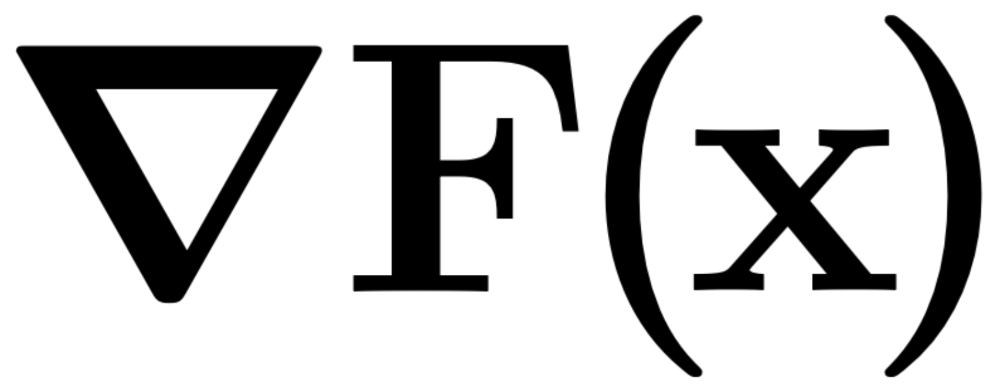

<div align="center">

<br><br>
  
# NablAFx

**differentiable black-box and gray-box audio effects modeling framework**

[Paper](https://arxiv.org/abs/2310.15247)

[Marco Comunità](https://mcomunita.github.io/)<sup>1</sup>, [Christian J. Steinmetz](https://www.christiansteinmetz.com/)<sup>1</sup>, [Joshua D. Reiss](http://www.eecs.qmul.ac.uk/~josh/)<sup>1</sup>

<sup>1</sup> Centre for Digital Music, Queen Mary University of London, UK<br>

</div>

## Abstract
We present NablAFx, an open-source framework developed to support research in differentiable black-box and gray-box modeling of audio effects. 
Built in PyTorch, NablAFx offers a versatile ecosystem to configure, train, evaluate, and compare various architectural approaches. 
It includes classes to manage model architectures, datasets, and training, along with features to compute and log losses, metrics and media, and plotting functions to facilitate detailed analysis. 
It incorporates implementations of established black-box architectures and conditioning methods, as well as differentiable DSP blocks and controllers, enabling the creation of both parametric and non-parametric gray-box signal chains.


```BibTex
@inproceedings{nablafx,
  title={Syncfusion: Multimodal Onset-Synchronized Video-to-Audio Foley Synthesis},
  author={Comunit{\`a}, Marco and Gramaccioni, Riccardo F and Postolache, Emilian and Rodol{\`a}, Emanuele and Comminiello, Danilo and Reiss, Joshua D},
  booktitle={ICASSP 2024-2024 IEEE International Conference on Acoustics, Speech and Signal Processing (ICASSP)},
  pages={936--940},
  year={2024},
  organization={IEEE}
}
```

## Setup

NablAFx was developed with Python 3.9.7.

PIP - Install requirements. First the **temporary** ones (for rational activations), than the **updated** ones:

```
python3 -m venv .venv
source .venv/bin/activate
pip install -r requirements_temp-for-rnl.txt
pip install --upgrade -r requirements.txt
```

move `weights/rationals_config.json` to: `.venv/lib/python3.9/site-packages/rational/rationals_config.json`.

CONDA - Install requirements. First the **temporary** ones (for rational activations), than the **updated** ones:
```
conda env create -f requirements_temp-for-rnl.yaml
conda env update -f environment.yml
conda activate nablafx
```

move `weights/rationals_config.json` to: `~/.conda/envs/nablafx/lib/python3.9/site-packages/rational/rationals_config.json`.

## Data

NablAFx is setup to work with the [ToneTwist AFx Dataset](https://github.com/mcomunita/tonetwist-afx-dataset), and so are the dataset classes provided in `./nablafx/data.py`, but you can also write your own custom class and use a different dataset.

Make data folder and either move data to that folder or create a symbolic link:

```
mkdir data
cd data
ln -s /path/to/TONETWIST-AFX-DATASET/
```

## Logs

NablAFx is setup to use _Weights&Biases_ for logging so, create an account and `wandb login` from terminal.

```
mkdir logs
```

Please note that if you want to save the logs to a specific subfolder, this needs to be created in advance (see `cfg/trainer/trainer_bb.yaml` for an example.

## Frechét Audio Distance checkpoints

The checkpoints to compute Frechét Audio Distance need to be in specific folders:

```
mkdir checkpoints_fad
```

The first time you will compute FAD (which is at test time) the checkpoints are automatically downloaded and placed into subfolders.

## Train

We use Lightning CLI to configure the training using separate `.yaml` files for data, model and trainer configurations, see examples in:

```
cfg/data
cfg/model
cfg/trainer
```

To make it super easy to start training we prepared shell scripts `scripts/train_bb.sh` or `scripts/train_gb.sh`, which look like this:

```
CUDA_VISIBLE_DEVICES=0 \
python scripts/main.py fit \
-c cfg/data/data-param_multidrive-ffuzz_trainval.yaml \
-c cfg/model/s4-param/model_bb-param_s4-tvf-b8-s32-c16.yaml \
-c cfg/trainer/trainer_bb.yaml
```

so that you just have to change the config paths to train your own model.

## Test

We did the same for testing, and prepared a shell script `scripts/test.sh` that looks like this:

```
CUDA_VISIBLE_DEVICES=0 \
python scripts/main.py test \
--config logs/multidrive-ffuzz/S4-TTF/bb_S4-TTF-B8-S32-C16_lr.01_td5_fd5/config.yaml \
--ckpt_path "logs/multidrive-ffuzz/S4-TTF/bb_S4-TTF-B8-S32-C16_lr.01_td5_fd5/nnlinafx-PARAM/p362csrv/checkpoints/last.ckpt" \
--trainer.logger.entity mcomunita \
--trainer.logger.project nablafx \
--trainer.logger.save_dir logs/multidrive-ffuzz/TEST/bb_S4-TTF-B8-S32-C16_lr.01_td5_fd5 \
--trainer.logger.name bb_S4-TTF-B8-S32-C16_lr.01_td5_fd5 \
--trainer.logger.group Multidrive-FFuzz_TEST \
--trainer.logger.tags "['Multidrive-FFuzz', 'TEST']" \
--trainer.accelerator gpu \
--trainer.strategy auto \
--trainer.devices=1 \
--config cfg/data/data-param_multidrive-ffuzz_test.yaml
# --data.sample_length 480000
```

While it looks complicated, it is just the case of replacing the paths to: model configuration, checkpoint, logging folder. 

## Params, FLOPs, MACs and Real-time factor:

Scripts to measure all these metrics of a model are in the `tests` folder. The code is not very organized and beautiful at the moment but does the job.

## Pre-train MLP Nonlinearity or FIR

The script to pretrain differentiable processors (see `nablafx/processors.py`) like a `StaticMLPNonlinearity` or a `StStaticFIRFilter` is `scripts/pretrain.py`.
Examples of pretrained nonlinearities and filters are in `weights`.

---

## Credits

* LSTM - [https://github.com/Alec-Wright/Automated-GuitarAmpModelling](https://github.com/Alec-Wright/Automated-GuitarAmpModelling)
* TCN - [https://github.com/csteinmetz1/micro-tcn](https://github.com/csteinmetz1/micro-tcn)
* GCN - [https://github.com/mcomunita/gcn-tfilm](https://github.com/mcomunita/gcn-tfilm)
* S4 - [https://github.com/int0thewind/s4-dynamic-range-compressor](https://github.com/int0thewind/s4-dynamic-range-compressor)
* dasp - [https://github.com/csteinmetz1/dasp-pytorch](https://github.com/csteinmetz1/dasp-pytorch)
* auraloss - [https://github.com/csteinmetz1/auraloss](https://github.com/csteinmetz1/auraloss)
